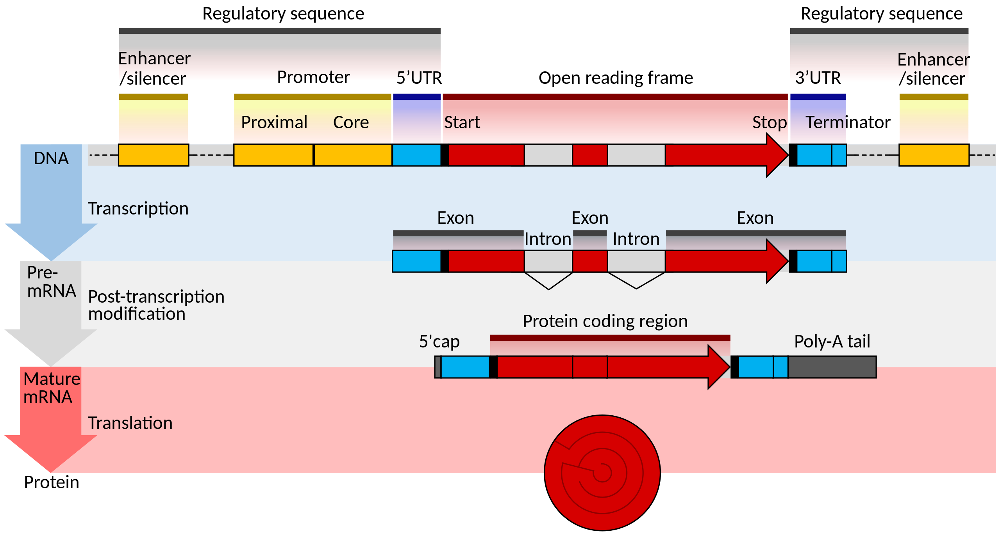
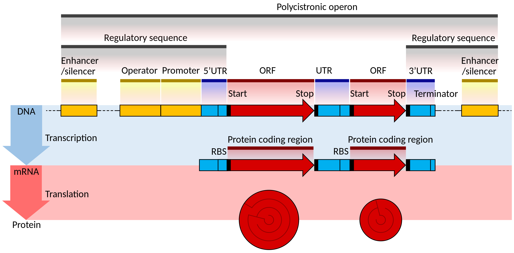

# AnnoKit

Reference genome annotation file processing toolset

## gene structure

### eukaryote

### prokaryote

## GTF

gtf file analysis

- [GTF](https://github.com/iOLIGO/AnnoKit/blob/main/docs/GTF.md)
